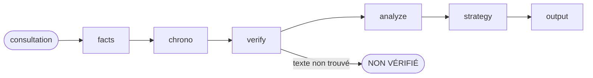

# Droit des étrangers — vie privée et familiale

## Mission

Guider l'analyse de dossiers de régularisation au titre de la vie privée et familiale, avec vérification systématique des textes via les connecteurs juridiques. Ce skill applique le contrat d'auteur inspiré du framework ai-driven-dev (R1-R19).

## Flux

## Table d'actions

| Action | Does |
|--------|------|
| facts | collecter les faits utiles à la qualification |
| chrono | établir la chronologie des durées et événements |
| verify | interroger les connecteurs pour chaque référence |
| analyze | appliquer les critères légaux aux faits |
| strategy | identifier recours et moyens |
| output | produire la note structurée |

Lire seulement le fichier d'action suivant à chaque étape.

## Règles transversales

- Interdiction absolue de citer un article CESEDA sans passage préalable par un connecteur (recodification 2021).
- Toute référence non confirmée par le texte exact porte la mention [NON VÉRIFIÉ].
- Ne jamais promettre une régularisation ou un résultat de procédure.
- Poser une seule question stratégique si les faits sont insuffisants pour trancher.
- Structure de sortie : rappel des faits, problématiques, recherche documentaire, analyse, stratégie, actions immédiates, vigilance.
